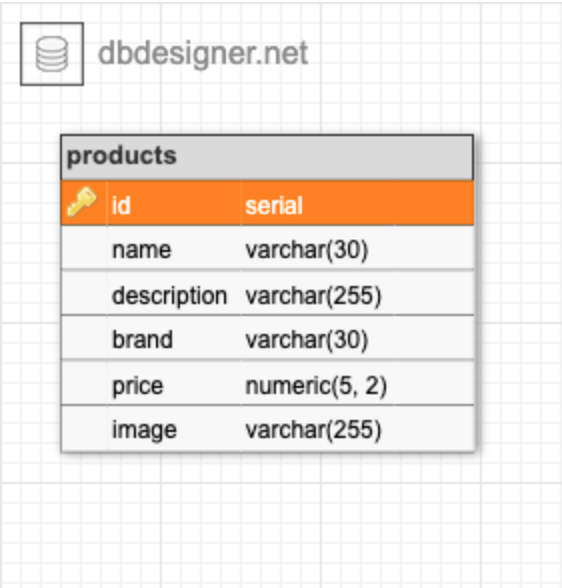

# Full-Stack App Product Management

This app was created for a technical interview at Arup. 
It
 - Lists all products
 - Displays product details for specific products
 - Updates product details using API endpoint

 ## Database Schema

The App consists of one DB table, called `products`, that manages the information about products.

## Install the App

1. Open two terminals, one each for server and client. (The `client` folder is a sub-folder of the server (= project) folder.) Type `npm install` in each terminal to install dependencies.
2. Create a DB: 
- [Install PostgreSQL](https://www.postgresql.org/download/)
- Log in to PostgreSQL CLI (with `psql -d postgres -U postgres` and enter your password when prompted
- Create a new user role by typing `CREATE ROLE my_user WITH LOGIN PASSWORD 'root';` 
- Give it permission to create databases with `ALTER ROLE my_user CREATEDB;` 
- Log out from superuser and to new user by typing `\q`
`psql -d postgres -U my_user`
- Type `CREATE DATABASE products;` to create the DB. You can then exit the CLI with `quit`.
3. Create your `.env` file in server folder that contains connect info so that Express can communicate with MySQL. Use `env.example` as an example.
5. Create requestAudit.txt file in server folder to log the page requests
4. In the server folder, type `npm run migrate`. This will create the DB table for the demo and add a couple of default entries and the stored procedures/functions used in the Backend routes. (If you're curious, the SQL that gets executed is in `model/init_db.sql`.)

## Run the App

1. In the server terminal, type `npm run start` to start the server.
2. In the client terminal, type `npm run start` to start the client.
3. Point your browser at `http://localhost:3000`.

